# Acoustic OFDM Transmission System

Acoustic implementation of an OFDM link developed for the EPFL **Wireless Receivers: Algorithms and Architectures** project.  
The system transmits digital data through a **speaker–microphone audio channel** and reconstructs it at the receiver with **frame synchronization, OFDM demodulation, channel estimation, and phase correction**.

## Repository contents

```text
.
├── channel/                # channel-characterization scripts
├── freq_offset/            # frequency-offset experiments
├── phase_estimate/         # phase-tracking experiments
├── results/                # analysis scripts
├── assets/images/          # figures used in this README
├── docs/
│   ├── Final_Report.pdf
│   └── Project_Instructions.pdf
├── ofdmtrans.m             # main end-to-end script
├── ofdm_tx.m               # transmitter
├── ofdm_rx.m               # receiver
└── ...
```

## What the project does

- Builds an **acoustic OFDM transmission chain**
- Uses **BPSK** for the preamble and training symbols
- Uses **QPSK** for payload data
- Adds a **cyclic prefix** to mitigate inter-symbol interference
- Estimates the channel from pilot symbols
- Evaluates performance under **static and moving channels**
- Demonstrates **image transmission** over the acoustic link

## Frame structure

The transmitted frame uses:
1. a **single-carrier BPSK preamble** for frame synchronization,
2. a **BPSK OFDM training symbol** for channel estimation,
3. **QPSK OFDM data symbols** with cyclic-prefix insertion.

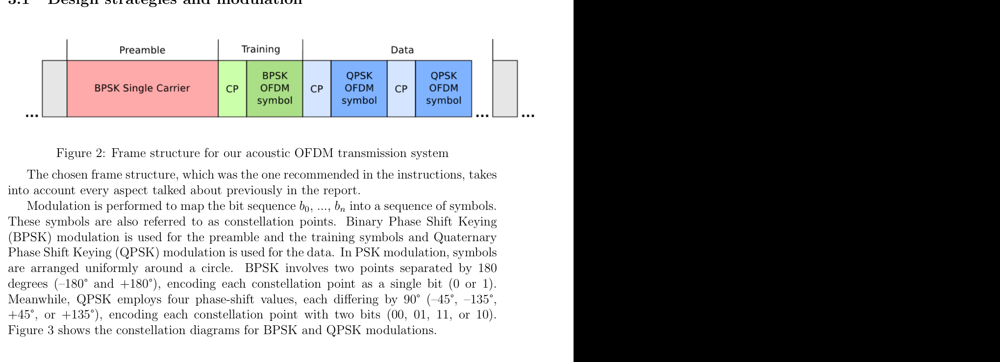

## Signal-processing chain

The main transmit / receive datapath is shown below.

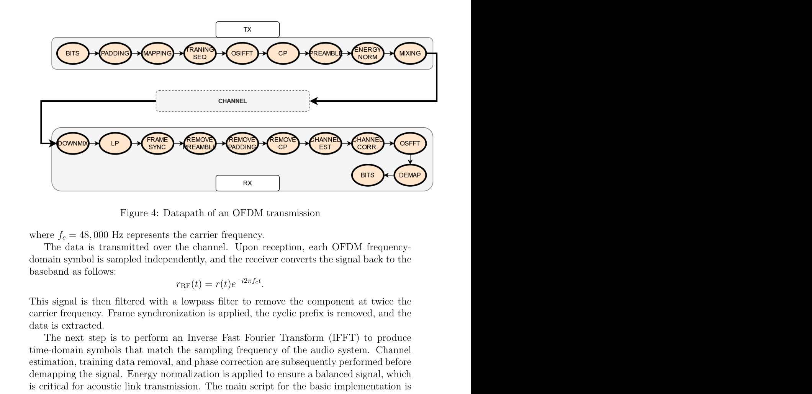

## Main implementation files

### Core OFDM chain
- `ofdmtrans.m` — main script used to run the full transmission
- `ofdm_tx.m` — transmitter
- `ofdm_rx.m` — receiver
- `osifft.m`, `osfft.m` — oversampled OFDM transforms for the audio setup
- `frame_sync.m` — frame synchronization
- `generate_pilot.m` — pilot generation
- `demapper.m` — symbol demapping

### Extensions and experiments
- `channel/` — channel-spectrum and delay-profile experiments
- `freq_offset/` — frequency-offset sensitivity experiments
- `phase_estimate/` — block-training / PLL phase-tracking experiments
- `results/analyze_channel.m` — spectrum analysis
- `results/analyze_pdp.m` — power-delay-profile analysis

## Example results

### Experimental setups

| Interior | Cavity | Exterior |
|---|---|---|
| 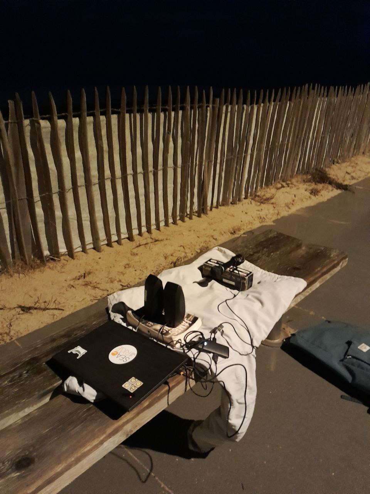 | 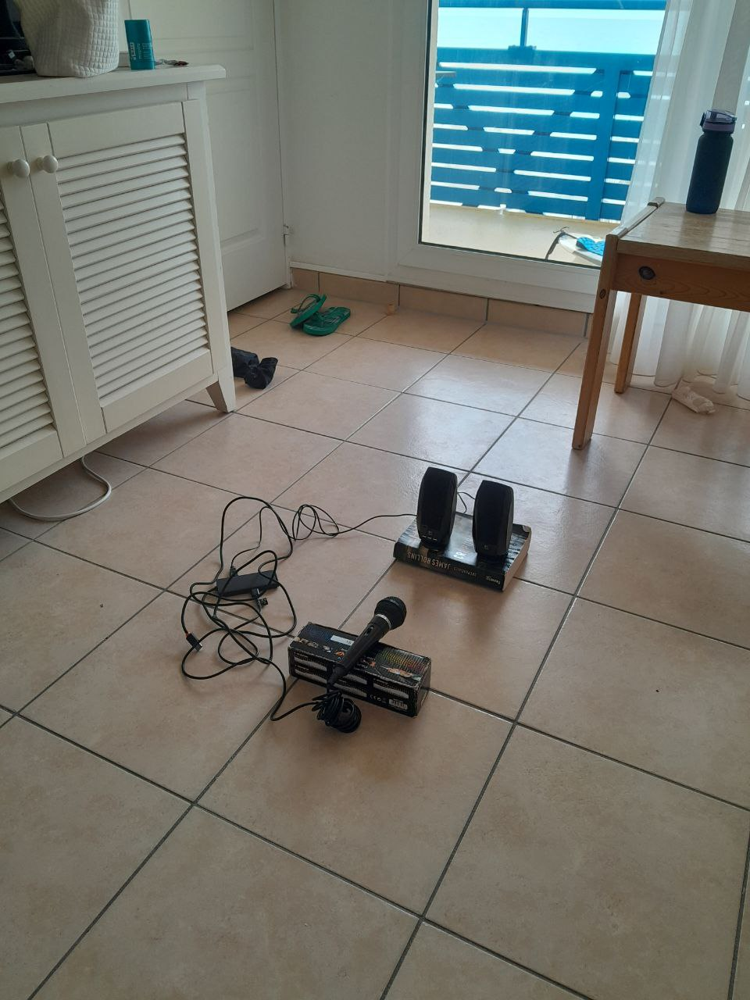 | 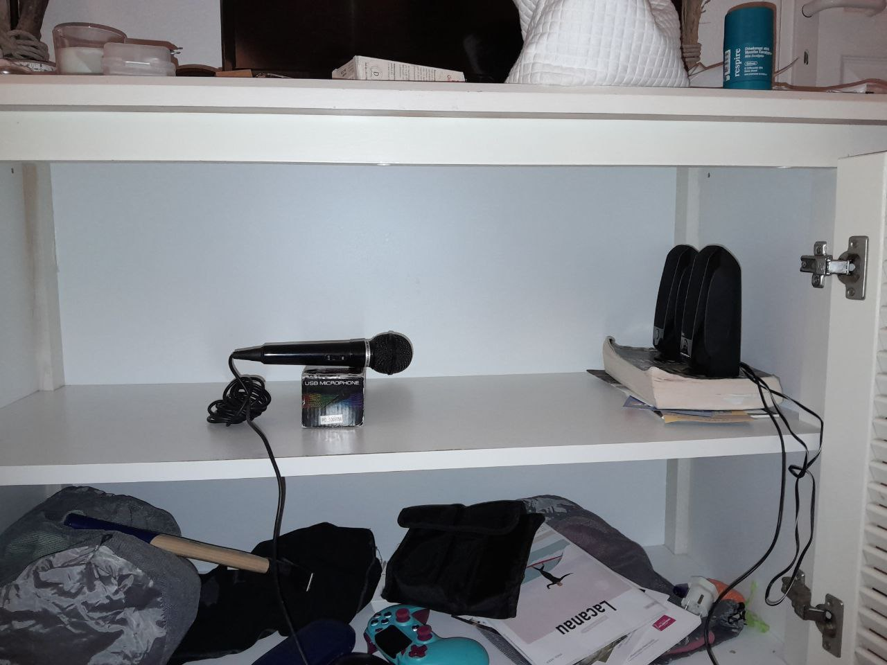 |

### Channel behavior

| Interior spectrum | Cavity spectrum | Exterior spectrum |
|---|---|---|
| 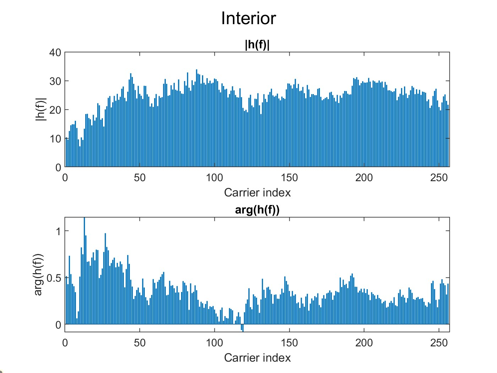 | 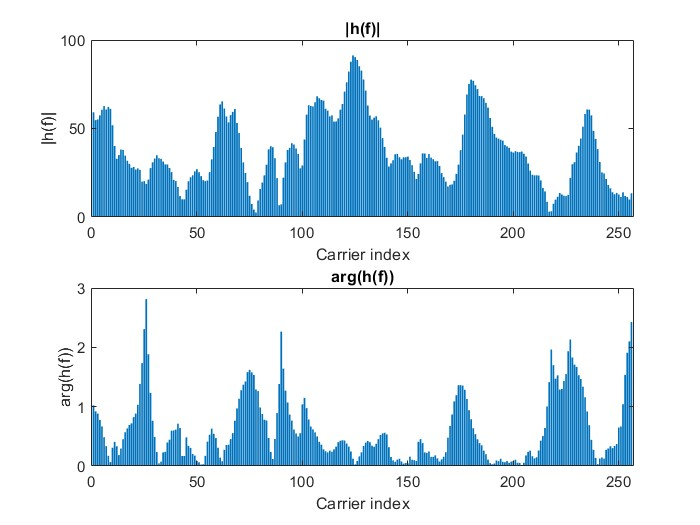 | 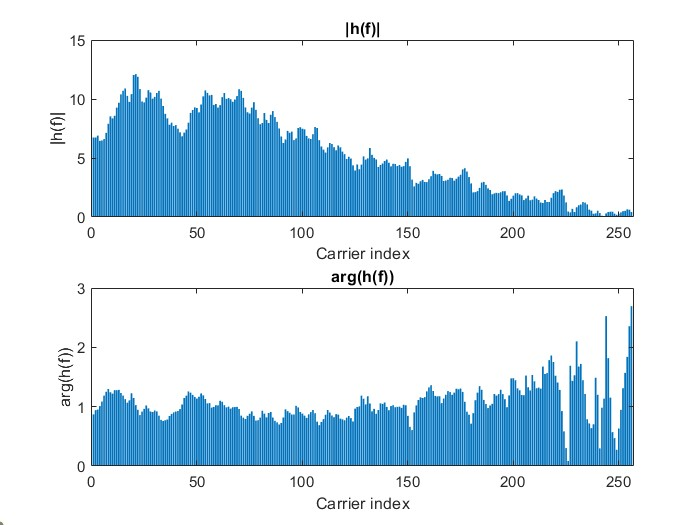 |

| Interior PDP | Cavity PDP | Exterior PDP |
|---|---|---|
| 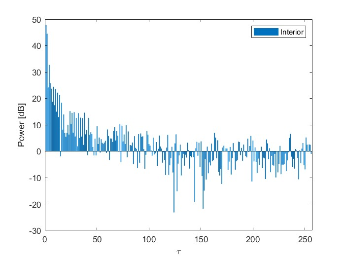 | 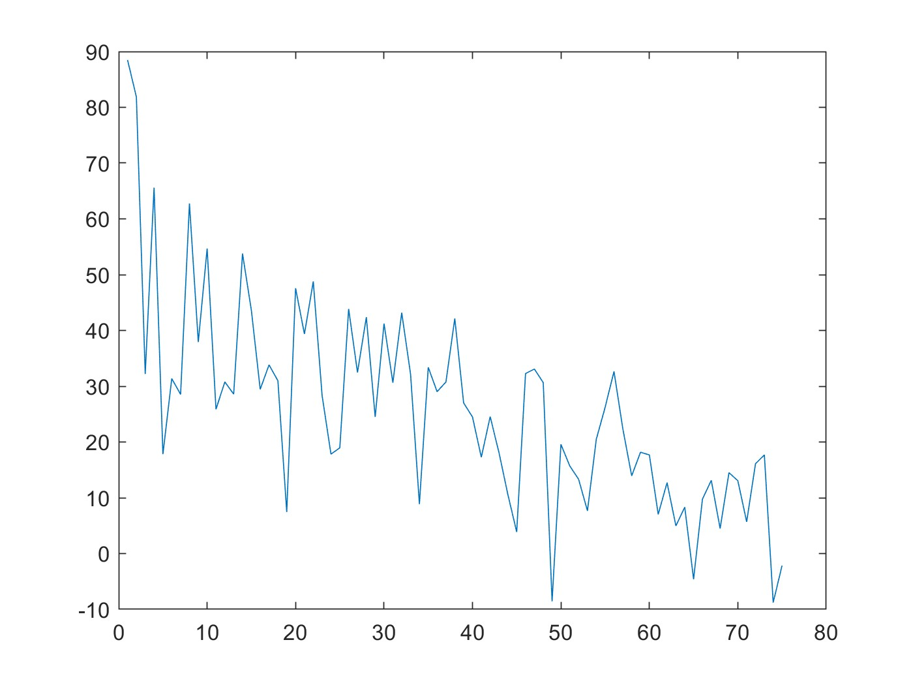 | 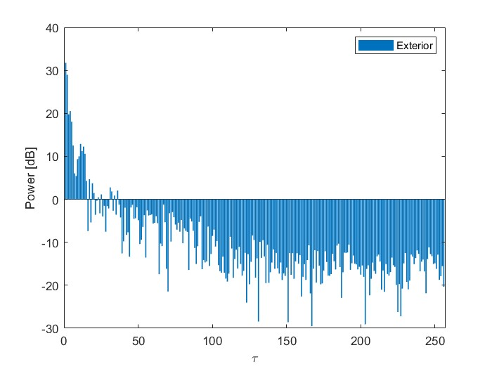 |

### Phase evolution

| Static channel | Moving channel |
|---|---|
| 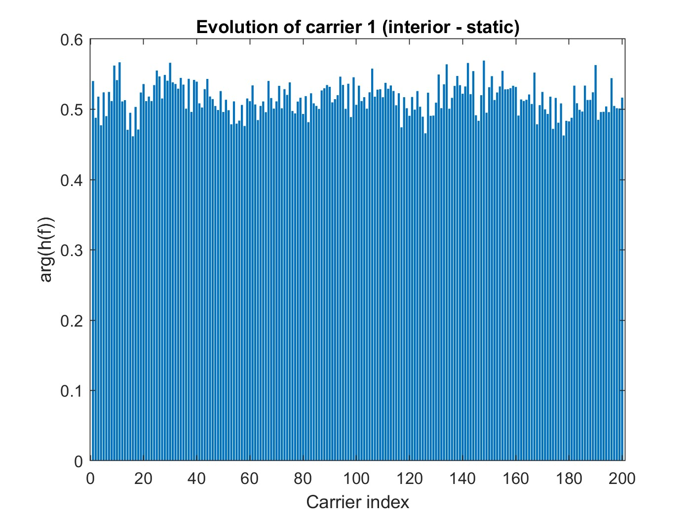 | 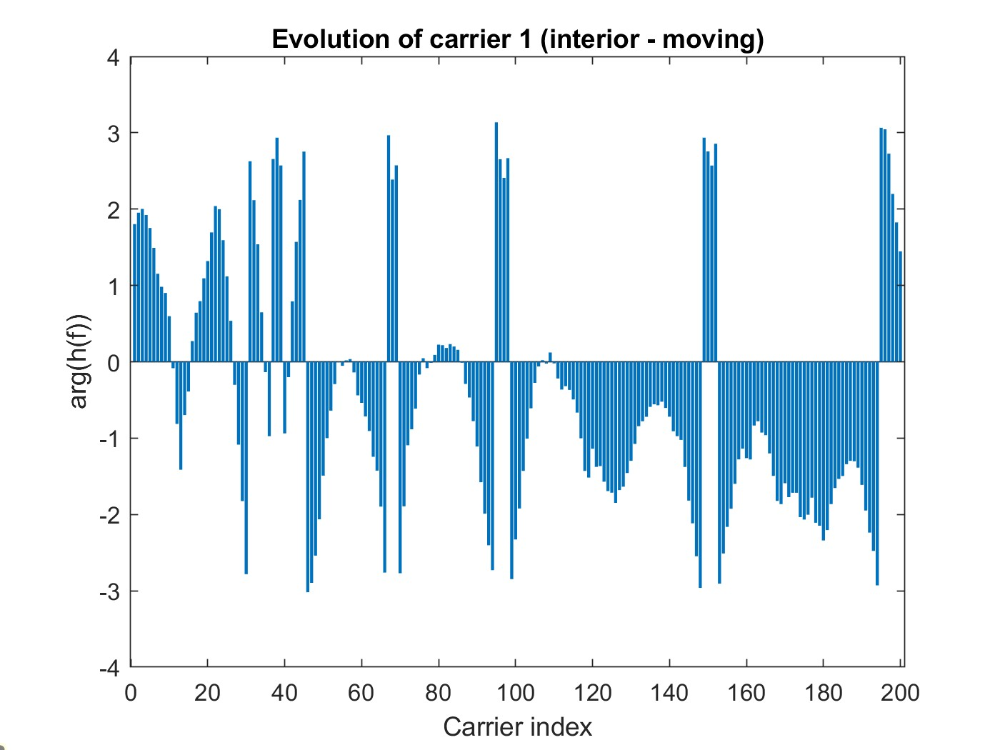 |

### BER vs distance

| 2 Hz spacing | 5 Hz spacing |
|---|---|
| 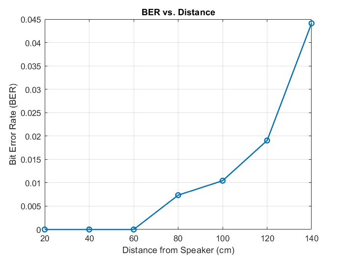 | 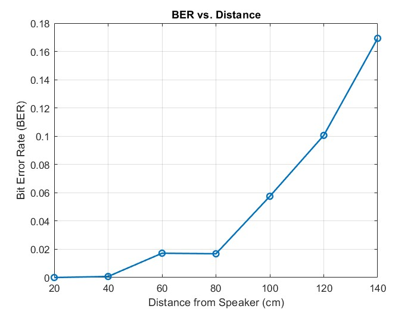 |

### Image transmission

Input image:


| Static channel | Moving channel, no tracking | Moving channel, with tracking |
|---|---|---|
| 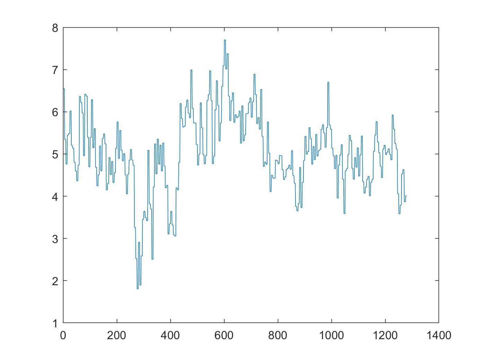 | 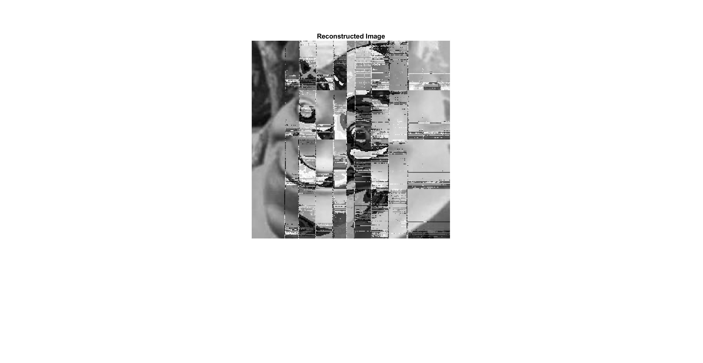 | 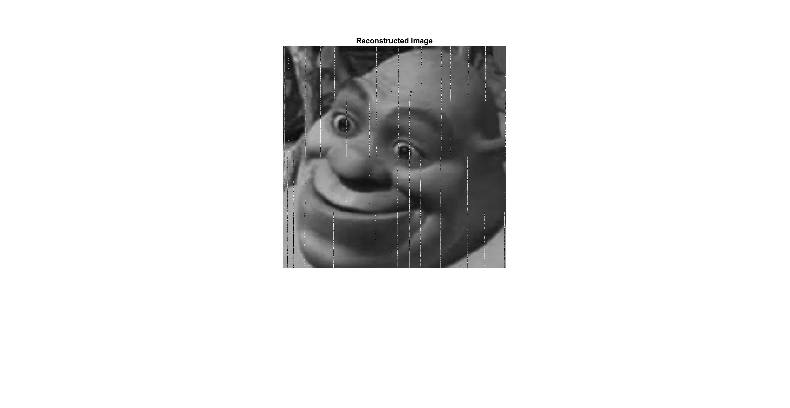 |

## How to run

This project was developed in MATLAB.

Typical entry point:
```matlab
ofdmtrans
```

The current scripts are set up for the project audio chain and include configurable parameters such as:
- sampling frequency,
- carrier frequency,
- number of OFDM carriers,
- carrier spacing,
- pilot frequency,
- cyclic-prefix length.

## Notes

- The repository was cleaned for GitHub use:
  - removed nested zip packaging,
  - removed large generated `.mat` dumps and temporary capture files,
  - kept the source code, report, instructions, and representative figures.
- If you want to reproduce every plot exactly as in the original working directory, you may need to regenerate some result files from the provided scripts.

## Authors

- Charlotte Heibig
- Antoine Branca
